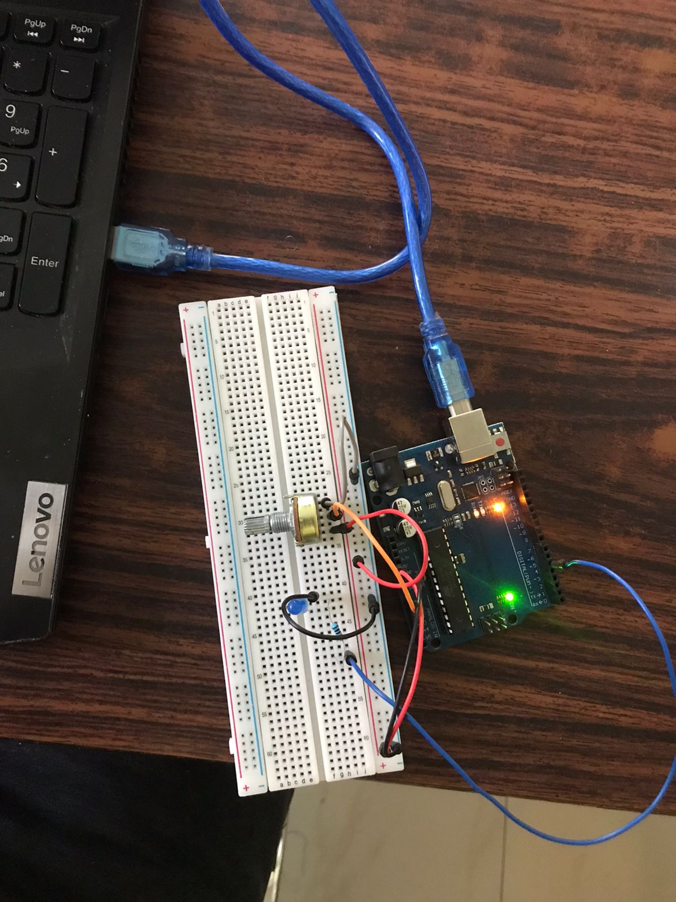
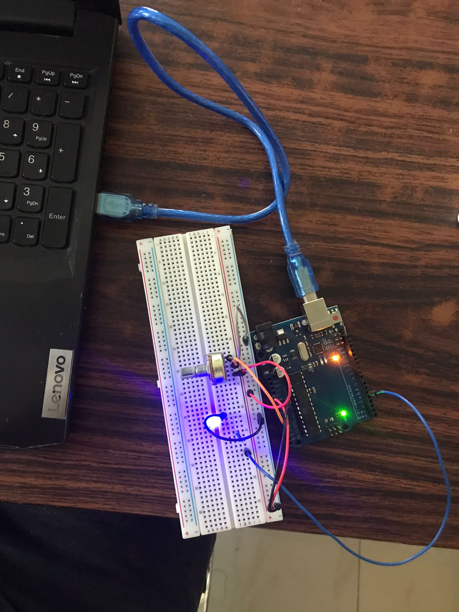

# LED Brightness Controller

This project uses a potentiometer to control the Brightness of an LED using `analogRead()` and `analogWrite()` functions powered by Arduino UNO R3.

## GIF

## Images

